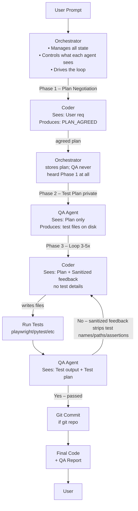

# Multi-Agent Coding Orchestrator

Orchestrates a plan → implement → QA feedback loop using three Claude Code native agents.

Lives at: `~/my_claude_automations/agents/` (symlinked into `.claude/agents/` of any repo via `link.sh`)

## Flow


## Usage

From any project directory, invoke the orchestrator agent:
```bash
# In Claude Code chat, mention the agent by name:
@acme_coding_agent Add a users search endpoint that filters by name and email
```

Or tell Claude directly in conversation:
> "Use the acme_coding_agent to implement: Add a search endpoint that filters by name and email"

Note: `/acme_coding_agent` (slash prefix) is NOT correct — that syntax is for skills, not agents.

## What It Does

1. **PLAN NEGOTIATION** — Orchestrator and Coder negotiate an implementation plan (≤10 turns)
2. **STRATEGY DETECTION** — Auto-detects test strategy from prompt + repo content
3. **TEST PLAN CREATION** — Orchestrator and QA privately agree on tests (Coder never sees this)
4. **IMPLEMENT** — Coder writes files to disk via JSON block
5. **QA EVALUATION** — Test suite runs; QA interprets results
6. **FEEDBACK LOOP** — Sanitized behavioral feedback goes to Coder (up to 3–5 rounds)
7. **GIT COMMIT** — Commits and pushes to current branch (skipped if not a git repo)
8. **DELIVER** — Final report printed to terminal

## Agents

| Agent | File | Model | Role |
|-------|------|-------|------|
| acme_coding_agent | `agents/acme_coding_agent.md` | claude-opus-4-6 | State machine driver, spawns sub-agents |
| coder | `agents/coder.md` | claude-sonnet-4-6 | Explores codebase, writes implementation files |
| qa | `agents/qa.md` | claude-sonnet-4-6 | Creates test plan, evaluates results |

## Strategy Auto-Detection

| Condition | Strategy |
|-----------|----------|
| Prompt contains "playwright" | playwright |
| Prompt contains "pytest" | pytest |
| Both present | combined |
| `.py` files in repo + portal/widget keywords | combined |
| Portal/widget keywords only | playwright |
| `.py` files only | pytest |
| Unclear | custom (QA proposes its own approach) |

## Test Strategies

- **playwright** — runs `npm test` in `~/my_claude_automations/playwright/`
- **pytest** — runs `pytest --tb=short -v` in the current repo; QA scaffolds test files if needed
- **combined** — runs both sequentially
- **custom** — QA agent proposes and implements its own test approach

## Context Isolation

The Coder **never** sees the QA test plan. The orchestrator sanitizes QA feedback to strip test
function names, file paths, and assertions before any feedback reaches the Coder. Only behavioral
failure descriptions are forwarded.

## Git Behaviour

- Detects git at startup via `git rev-parse`
- If not a git repo (e.g. service_desk platform): commit step silently skipped
- Commits to the **current branch** — no branch creation, no PR
- Commit message format: `` `feat: <plan summary> [passing|partial]` ``

## Setup

The agents are automatically available in any repo that has been linked:
```bash
~/my_claude_automations/link.sh /path/to/your/repo
```

This symlinks `~/my_claude_automations/agents/` into `.claude/agents/` of the target repo.