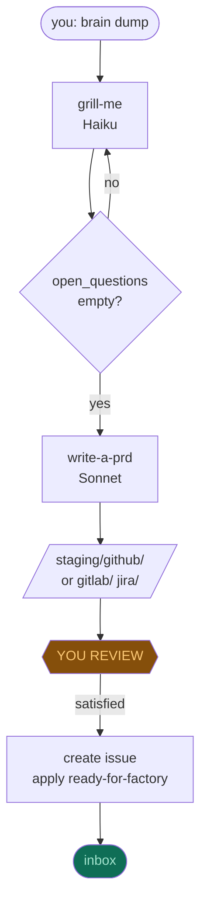
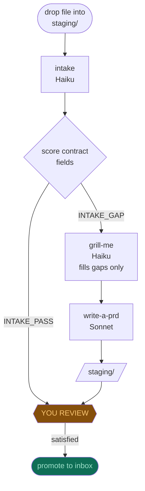
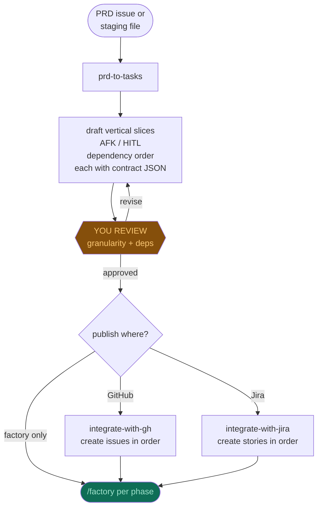
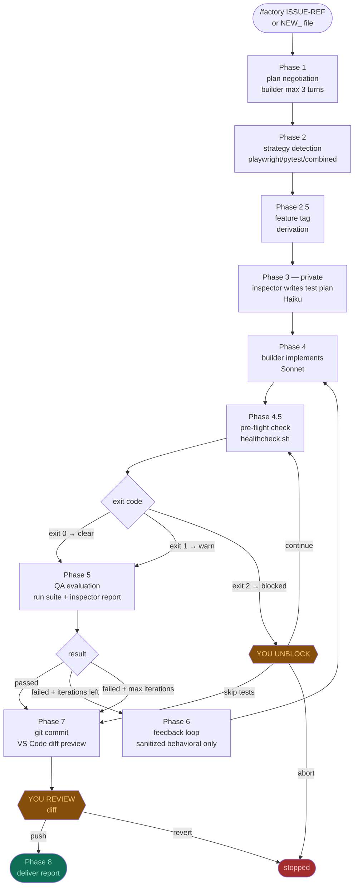
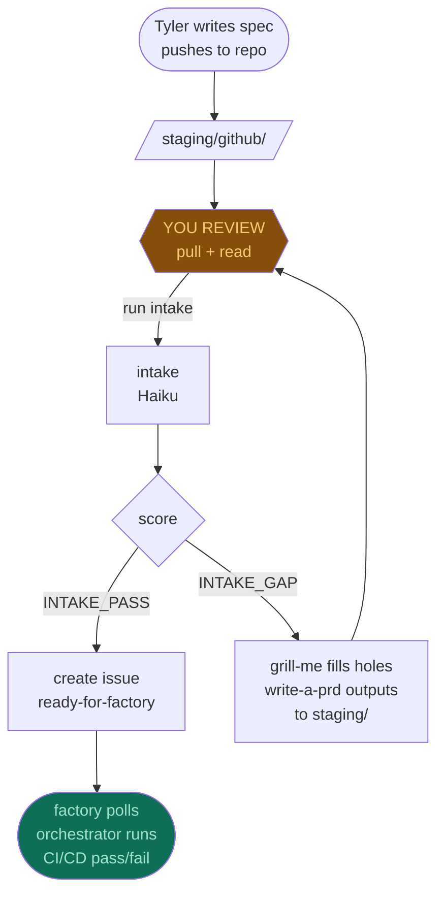

# lights-out factory

A human-gated, spec-driven software factory built on Claude Code agents. Converts ideas and issues into committed, tested code — with you in control of every stage boundary.

---

## Installation

### Prerequisites

```bash
pip install anthropic --break-system-packages
```

On VZ — run inside your Docker container. On mustafar — system install is fine.

### File Placement

Copy files to these exact paths under your repo root:

```
.claude/
  factory/
    README.md
    orchestrator.py
    factory_config.json
    logs/               ← auto-created on first run
  staging/
    github/
    gitlab/
    jira/
  commands/
    factory.md
  agents/
    builder.md
    inspector.md
    intake.md
  skills/
    grill-me/SKILL.md
    write-a-prd/SKILL.md
    prd-to-tasks/SKILL.md
    integrate-with-gh/SKILL.md
    integrate-with-jira/SKILL.md
```

### Create directories

```bash
mkdir -p .claude/factory/logs
mkdir -p .claude/staging/github
mkdir -p .claude/staging/gitlab
mkdir -p .claude/staging/jira
mkdir -p .claude/agents
mkdir -p .claude/commands
mkdir -p .claude/skills/grill-me
mkdir -p .claude/skills/write-a-prd
mkdir -p .claude/skills/prd-to-tasks
mkdir -p .claude/skills/integrate-with-gh
mkdir -p .claude/skills/integrate-with-jira
```

### Make orchestrator executable

```bash
chmod +x .claude/factory/orchestrator.py
```

### Update factory_config.json

Edit these values for your environment if required:

```json
{
  "models": {
    "builder": "claude-sonnet-4-6",
    "inspector": "claude-haiku-4-5-20251001"
  },
  "max_iterations": 3,
  "repo_root": "{repo_root}",
  "agent_dir": "{repo_root}/.claude/agents",
  "log_dir": "{repo_root}/.claude/factory/logs",
  "playwright_dir": "~/my_claude_automations/playwright",
  "healthcheck_script": "~/my_claude_automations/healthcheck.sh",
  "vscode_diff_script": "{repo_root}/.claude/hooks/vscode-diff.sh"
}
```

Set `max_iterations` to 5 if the PRD's Definition of Done warrants it.

### Generate your EEC config

The EEC (Execution Environment Contract) tells the factory how your repo is structured: test paths, forbidden writes, import rules, and execution commands. A template lives at `.claude/factory/eec.template.json`.

**Don't fill it by hand.** Instead, ask Claude:

> "Read `.claude/factory/orchestrator.py` and scan this repo's structure, then suggest values for each field in `eec.template.json`. Write the result to `{repo_name}_eec.json`."

Claude will read the orchestrator to understand every field's purpose, then scan your actual test layout, import conventions, and entry points — producing a populated file you review and adjust rather than author from scratch.

Key points:
- `test_strategy` (`pytest` / `playwright` / `combined`) belongs in each **PRD's JSON contract block**, not in the EEC. The EEC `test_command` is a pytest runtime invocation only.
- `playwright_command` lives in `factory_config.json`, not the EEC.
- Set `maturity: "established"` only after you've manually confirmed the test suite runs end-to-end.

### Verify installation

```bash
# Check anthropic SDK
python3 -c "import anthropic; print('SDK ok')"

# Check config loads and orchestrator runs
python3 .claude/factory/orchestrator.py --help

# Check staging dirs exist
ls .claude/staging/
```

### Monitor a running factory

When `/factory` launches orchestrator.py it will print:

```
Watch: watch cat /tmp/factory-{pid}.txt
Log:   .claude/factory/logs/{plan-name}/run.log
```

Keep that watch command — it is your live view into what the factory is doing.

---

## Philosophy

> Too loose a spec burns tokens reworking. Too tight and you never automate. The PRD is the contract. Everything downstream checks work against it.

Three failure modes this system prevents:

- **Eager execution** — Claude runs into implementation with no review gate
- **Vague feedback loops** — agents rework indefinitely because acceptance criteria weren't testable
- **Context bleed** — QA test details leak to the builder, inflating iteration cost

---

## Staging File Naming Convention

```
NEW_owner-repo_feature-name.prd.md      ← ready to ship, unreviewed
IP_owner-repo_feature-name.prd.md       ← in flight, orchestrator running
done-YYYYMMDD-HHMM-feature-name.prd.md ← archived on completion
```

Factory only touches `NEW_` files. `IP_` rename happens automatically on confirm. `done-` archive is written by orchestrator.py on delivery.

**Inbox = API label.** Factory polls `ready-for-factory` labels on GitHub/GitLab/Jira. You promote a staging file by manually creating the issue (mvp1).

---

## The PRD Contract

Every issue entering the factory must satisfy these fields. The `intake` agent scores each one.

| Field | Required |
|-------|----------|
| `feature` | One sentence — what is being built |
| `context` | Repo, service, affected area |
| `problem_statement` | User-facing problem |
| `solution` | Proposed solution |
| `user_stories` | At least one behavioral "as a... I want... so that..." |
| `acceptance_criteria` | At least two testable, behavioral criteria |
| `constraints` | HIPAA, security, perf, API contracts — or explicitly "none" |
| `out_of_scope` | At least one explicit exclusion |
| `definition_of_done` | Exit condition — when does the orchestrator commit? |
| `scope_type` | `surgical_fix` / `feature_add` / `refactor` / `new_domain` — drives iteration budget |
| `test_strategy` | `pytest` / `playwright` / `combined` — drives inspector and QA phase |
| `estimated_files` | Complete write scope — builder may only touch listed files |
| `open_questions` | Must be **empty** before handoff to orchestrator |

---

## Skills

### `grill-me` (Haiku)
Interviews you one question at a time until open questions are empty. Outputs structured JSON matching PRD contract fields. Standalone — run it against any PRD with holes.

### `write-a-prd` (Sonnet)
Takes grill-me JSON and synthesizes a formal PRD. Explores codebase, identifies deep modules. Outputs to `staging/` — never directly to an API.

### `prd-to-tasks`
Breaks a PRD into tracer-bullet vertical slices saved as a local `.claude/planning/` file. Each phase carries its own contract JSON block (`scope_type`, `test_strategy`, `estimated_files`) so it can be handed directly to `/factory`. Does NOT own decomposition for integration targets — use `integrate-with-gh` or `integrate-with-jira` to publish the approved breakdown.

### `integrate-with-gh`
Mechanical GitHub operations: list issues, view PRs, create issues, comment, close. Publishes an approved `prd-to-tasks` breakdown as GitHub issues in dependency order. Does not own decomposition.

### `integrate-with-jira`
Mechanical Jira operations: fetch tickets, list open issues, comment, transition status, take ownership. Publishes an approved `prd-to-tasks` breakdown as Jira stories. Credentials from `$JIRA_URL`, `$JIRA_EMAIL`, `$JIRA_API_TOKEN` — never hardcoded.

### `intake` (Haiku)
Scores a staging file or live issue against the PRD contract. Routes to grill-me if gaps found. Never auto-promotes.

---

## Agents

### `builder` (Sonnet)
Implementation agent. Confirms PRD plan in max 3 turns, writes all files in a single JSON block, iterates on behavioral feedback. No test internals ever reach it.

### `inspector` (Haiku)
QA agent. Adversarial mindset. Creates test plan privately, writes test files, evaluates results, reports behavioral failures only. Builder never sees inspector output.

### `intake` (Haiku)
Scores spec completeness, routes to grill-me or write-a-prd.

---

## Workflows

### Workflow 1 — Brain dump to PRD



### Workflow 2 — Solid PRD with small holes



### Workflow 3 — PRD to task breakdown and publish



### Workflow 4 — Orchestrator run



### Workflow 5 — Tyler writes spec (EMR)



---

## Gate Summary

| Gate | What you decide |
|------|----------------|
| staging → inbox | is this spec good enough to run? |
| prd-to-tasks review | is the slice granularity right? |
| intake INTAKE_GAP | fill holes or rewrite? |
| pre-flight exit 2 | fix infrastructure or skip tests? |
| post-commit diff | push or revert? |

---

## Context Isolation Rules

- Inspector test file names never reach the builder
- Assertion details stripped before feedback
- Only behavioral descriptions forwarded
- Test plan created privately — builder never sees it

---

## Cost Model

| Component | Model | Why |
|-----------|-------|-----|
| grill-me | Haiku | Q&A, cheap |
| intake | Haiku | scoring + routing only |
| inspector | Haiku | test plan + evaluation |
| write-a-prd | Sonnet | synthesis |
| builder | Sonnet | implementation |
| orchestrator | Python | zero model cost for routing |

---

## Multi-repo Context

| Context | Issue source | Runner | Who writes spec |
|---------|-------------|--------|----------------|
| EMR | GitHub | GitHub Actions (mvp2) | Scott or Tyler |
| VZ | Jira / GitLab | GitLab CI (mvp2) | Scott |
| Personal | GitHub | local pytest/playwright | Scott |

---

## Commands

| Command | Status | Notes |
|---------|--------|-------|
| `/factory` | mvp1 | PRD-driven entry point |
| `/ship` | legacy | acme_coding_agent.md — untouched |
| `/promote` | preserved | lifeboat for ad-hoc planning sessions |

---

## MVPs

| MVP | Focus |
|-----|-------|
| 1 | Spec pipeline + human-gated staging |
| 2 | Python orchestrator + CI/CD trust layer |
| 3 | Lights-out AFK/HITL automation |

---

## Open TODOs

- [ ] tune PRD contract v1 from first real run data
- [ ] GitHub Actions runner config for EMR (mvp2)
- [ ] GitLab CI runner config for VZ (mvp2)
- [ ] runner result parser — normalize exit codes across sources (mvp2)
- [ ] persistent factory log so watch command is never buried in terminal history (mvp2)
- [ ] ollama/qwen provider support in call_claude() for acme-debate (mvp2)
- [ ] `factory --promote` — auto-promote staging file to issue (mvp3)
- [ ] HITL/AFK orchestration — pause on hitl label (mvp3)
- [ ] Tyler github → factory trigger — no Scott intervention (mvp3)
